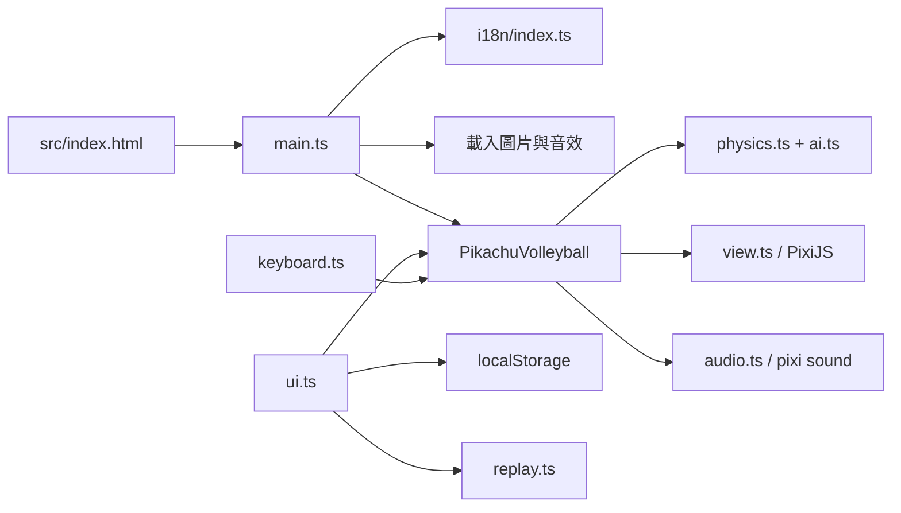

# 架構總覽

Pikachu Volleyball 是一個單頁 TypeScript 遊戲。Vite 負責開發與建置，PixiJS 負責畫面，`@pixi/sound` 負責音效。遊戲邏輯和畫面分開，讓物理引擎可在 Node.js 測試中獨立執行。

## 執行流程

`main.ts` 必須先載入 `i18n/index.ts`。韓文模式會在載入精靈圖前替換部分圖片鍵值。之後 `main.ts` 載入資源、建立 PixiJS 應用程式，並建立 `PikachuVolleyball`。

## 模組責任

| 層 | 位置 | 責任 |
| --- | --- | --- |
| 頁面 | `src/index.html` | HTML 結構、選單按鈕、對話框、PWA 更新提示。 |
| 啟動 | `src/resources/js/main.ts` | 初始化 PixiJS、載入資源、設定固定步進遊戲迴圈。 |
| Controller | `src/resources/js/pikavolley.ts` | 選單、回合、計分、暫停、1v1/2v2 切換、重播錄製與播放。 |
| Model | `physics.ts`、`ai.ts`、`cloud_and_wave.ts` | 球、玩家、碰撞、電腦 AI 與背景運動。此層不依賴 DOM、PixiJS 或音效。 |
| View | `view.ts` | 將 Model 的資料畫成 PixiJS 精靈與文字。 |
| 輸入與 UI | `keyboard.ts`、`ui.ts` | 將鍵盤及頁面操作轉成 Controller 的動作。 |
| 服務 | `audio.ts`、`replay.ts`、`i18n/`、`utils/` | 音效、可重播資料、語系與瀏覽器儲存空間。 |
| 靜態資源 | `public/resources/assets/` | 精靈圖、圖片與音效；Vite 直接複製到發行版本。 |

## 一個遊戲步進

預設模擬頻率是 25 FPS。`main.ts` 使用累加器把瀏覽器的繪製頻率轉成固定步進，避免螢幕更新率改變遊戲物理。

1. `PikachuVolleyball.gameLoop()` 從每個 `PikaKeyboard` 凍結本次輸入。
2. Controller 執行目前的狀態，例如開場、選單、回合或回合結束。
3. 回合狀態呼叫 `PikaPhysics.runEngineForNextFrame()`。
4. 物理引擎更新球與世界的碰撞、玩家移動、隊友碰撞及球與玩家的碰撞。
5. 引擎回傳音效事件與球是否落地。Controller 依結果播放音效、計分或切換回合。
6. `GameView` 讀取更新後的 Model，並由 PixiJS 繪製畫面。

慢動作使用 5 FPS，持續 6 個遊戲步進。

## 對戰模式

| 模式 | 玩家數 | 場地寬度 | 說明 |
| --- | --- | --- | --- |
| 1v1 | 2 | 432 | 原作相容模式。 |
| 2v2 | 4 | 576 | 本專案擴充。包含同隊玩家的碰撞與疊站規則。 |

`PikaPhysics` 用每個實例的 `groundWidth` 管理場地。不要把 2v2 的場地寬度寫回全域常數，否則 1v1 的行為會改變。

## 確定性與重播

物理引擎主要使用 32 位元整數運算。亂數集中在 `rand.ts`，重播以種子和每個步進的輸入重建對局。這使 `physics.test.ts` 和 `replay.test.ts` 可檢查行為是否穩定。

修改引擎時：

- 保留 `| 0` 的整數截斷語意。
- 使用 `rand()`，不要直接改用 `Math.random()`。
- 保留 `FUN_xxxxxxxx` 註解，它們對應原始遊戲的逆向工程位置。
- 同時驗證 1v1、2v2 與重播。

詳細規則請看[遊戲引擎分析](./engine/README.md)。

## 語系與瀏覽器資料

支援的語系是 `en`、`ko`、`zh`。語系判定順序如下：

1. 網址的 `?lang=`。
2. `localStorage` 的 `pv-locale`。
3. 瀏覽器語言。
4. 英文。

`ui.ts` 使用 `localStorageWrapper` 保存圖像、背景音樂、音效、速度、勝利分數與最近一次重播。模式選擇也以 `pv-offline-mode` 保存。瀏覽器禁止儲存空間時，包裝函式會記錄錯誤，但遊戲仍可繼續執行。

## 建置與發布

`vite.config.ts` 將 `src/` 作為 Vite 根目錄，輸出到 `dist/`，並同時建置主遊戲與更新紀錄頁。`vite-plugin-pwa` 在正式建置時產生 `sw.js`。`src/index.html` 只在正式模式註冊它，並在新版本等待啟用時顯示更新提示。
